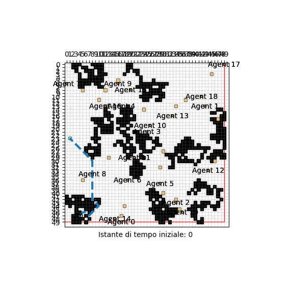

## INFORMAZIONI SUL PROBLEMA
| **Parametri** | Valori |
| --- | --- |
| **Dimensioni della griglia** | 50x50 |
| **Traversabilità della griglia** | 0.8 |
| **Agglomerazione ostacoli** | 0.1 |
| **Numero Agenti** | 20 |
| **Tempo max** | 60 |
| **Nodo iniziale** | 247 |
| **Nodo Finale** | 73 |

 **Percorso agenti**:
- Agente 01: [899, 948, 998, 999, 1048, 1049, 998, 1048, 998, 948, 897, 946, 946, 896, 897, 948, 898, 847, 897]
- Agente 02: [2163, 2213, 2264, 2264, 2313, 2312, 2263, 2214, 2214, 2214, 2213, 2162, 2113, 2113, 2164, 2163, 2212, 2163, 2212, 2263, 2314, 2365, 2316, 2316, 2365, 2316, 2367]
- Agente 03: [1743, 1744, 1794, 1795, 1796, 1845, 1894, 1895, 1944, 1944, 1895, 1896, 1845, 1844, 1795, 1846, 1847, 1846, 1897, 1846, 1846, 1795, 1744, 1794, 1795, 1795, 1795, 1796, 1847, 1847, 1896, 1845, 1845, 1796, 1796, 1796, 1796, 1797, 1796, 1796, 1796, 1795]
- Agente 04: [1271, 1322, 1372, 1373, 1324, 1375, 1426, 1377, 1326, 1276, 1275, 1326, 1275, 1326, 1276, 1326, 1326, 1377, 1326, 1325, 1324, 1275, 1275, 1324, 1375, 1326, 1375, 1426, 1477, 1426, 1426, 1477, 1527, 1478, 1527, 1476, 1525, 1526, 1576, 1577, 1527, 1526, 1527]
- Agente 05: [863, 814, 813, 763, 812, 762, 712, 713, 762, 811, 810, 809, 759, 708, 758, 807, 806, 806, 806, 805, 756, 706, 705, 706, 655, 654, 703, 653, 652, 653, 604, 605, 604, 604, 604, 605, 604, 655, 604, 604, 605, 605, 556, 605, 605, 606, 607, 558, 609, 608]
- Agente 06: [1487, 1486, 1437, 1438, 1487, 1487, 1436, 1487, 1537, 1586, 1637, 1638, 1589, 1538, 1539, 1489, 1540]
- Agente 07: [986, 987, 1036, 1087, 1136, 1185, 1234, 1284, 1234, 1233, 1284, 1335, 1284, 1284, 1285, 1284, 1283, 1284, 1334, 1384, 1383, 1333, 1332, 1383, 1384, 1383, 1382, 1331, 1332, 1332, 1382, 1431, 1481, 1482]
- Agente 08: [6, 56, 6, 6, 55, 106, 57, 58, 59, 8, 59, 9, 10, 60, 110, 59, 59, 108, 57, 6, 55, 106, 107, 58, 8, 58, 9, 60, 61, 110, 61, 61, 111, 112, 111, 160, 209, 258, 258]
- Agente 09: [434, 485, 435, 434, 485, 485, 436, 385, 335, 286, 337, 337, 286, 337, 337, 286]
- Agente 10: [806, 856, 806, 757, 757, 758, 759, 760, 760, 710, 661, 711, 762, 712, 661, 662, 713, 662, 613, 564, 563, 613, 664, 714, 663, 613, 662, 611, 562, 511, 462, 461, 460, 511, 511]
- Agente 11: [1319, 1318, 1269, 1268, 1319, 1320, 1319, 1370, 1370, 1421, 1370, 1369, 1368, 1417, 1416, 1465, 1464, 1514, 1565, 1614, 1664, 1713, 1713]
- Agente 12: [1079, 1029, 1030, 981, 1030, 1030, 981, 980, 929, 879, 929, 980, 981, 931, 981, 1031, 982, 931, 982, 931, 881, 880, 830, 831, 781, 832, 782, 831, 881, 830, 829, 828, 877, 877, 827, 777, 826, 776, 777, 827, 876, 826, 776, 777, 828, 778, 779, 728, 728, 779, 728, 679]
- Agente 13: [2233, 2232, 2232, 2181, 2180, 2179, 2180, 2180, 2180, 2130, 2181, 2231, 2181, 2182, 2181, 2232, 2233, 2282, 2332, 2333, 2334, 2383, 2332, 2382, 2331, 2332, 2383, 2382, 2432, 2383, 2333, 2282, 2281, 2330, 2331, 2281, 2330, 2330, 2330]
- Agente 14: [1666, 1617, 1668, 1617, 1616, 1665, 1615, 1614, 1565, 1565, 1514, 1514, 1515, 1465, 1415, 1364, 1365, 1315, 1366, 1366, 1315, 1265, 1214]
- Agente 15: [798, 847, 848, 799, 749, 748, 749, 699, 648, 649, 698, 747, 798, 797, 847, 847, 796, 796, 847, 798, 748, 797, 747, 748, 697, 747, 698, 748, 797, 797, 847, 796, 797, 846, 895, 846, 847, 796, 845, 894, 945, 945, 894, 943, 944, 944]
- Agente 16: [1008, 1057, 1008, 1007, 956, 955, 905, 854, 905, 905, 855, 805, 854, 855, 905, 956, 907, 856, 856, 856, 807, 856, 855, 805, 756, 707, 656, 656, 657, 608, 607, 558, 508, 509, 510, 461, 512, 513, 564, 513, 514, 513, 562, 561, 612, 613]
- Agente 17: [613, 663, 712, 761, 712, 763, 762, 711, 662, 711, 662, 611, 660, 709, 658, 609, 659, 708, 657, 657, 607, 658, 707, 656, 607, 658, 707, 706, 755, 754, 803, 804, 754, 805]
- Agente 18: [2450, 2450, 2401, 2350, 2300, 2300, 2300, 2251, 2251, 2300, 2301, 2251, 2302, 2301, 2251, 2252, 2203, 2254, 2303, 2253, 2254, 2255, 2254, 2204, 2254, 2255, 2306, 2306, 2257, 2258, 2257, 2256, 2305, 2305, 2304, 2253, 2253]
- Agente 19: [2110, 2160, 2109, 2110, 2061, 2111, 2160, 2109, 2060, 2009, 2058, 2009, 1959, 1960, 2011, 2010, 1960, 1910, 1861, 1861, 1860, 1909, 1910, 1911, 1862, 1812, 1861, 1861]
- Agente 20: [1846, 1796, 1796, 1845, 1794, 1844, 1845, 1844, 1844, 1794, 1743, 1742]

<!-- ************************** -->
## RISULTATO DELLA RICERCA: SOLUZIONE TROVATA
  * **Percorso trovato:** [247, 296, 346, 397, 446, 495, 544, 493, 442, 441, 440, 439, 438, 437, 436, 435, 434, 433, 432, 431, 430, 379, 328, 277, 226, 175, 124, 73]
  * **Lunghezza del percorso trovato:** None
  * **Costo del percorso:**  32.80
  * **Totale stati generati:** None
  * **Numero azioni Wait:** 0
  * **Percentuale di griglia visitata:** 5.95
  * **Nodi unici visitati:** 119

<!-- ************************** -->
## PERFORMANCE
* Tempo per la generazione dell'istanza: 1.5625000000e-02 sec
* Tempo per la generazione dell'euristica: 0.0000000000e+00 sec
* Tempo per la ricerca della soluzione: 1.5625000000e-02 sec
* Memoria griglia: 0.046875 kbs
* Memoria euristica: 0.046875 kbs
* Memoria closed: 8.2109375 kbs
* Memoria open: 0.046875 kbs
* Memoria path: 0.2734375 kbs

